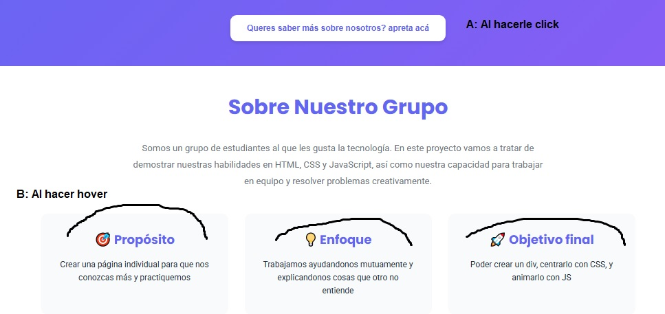
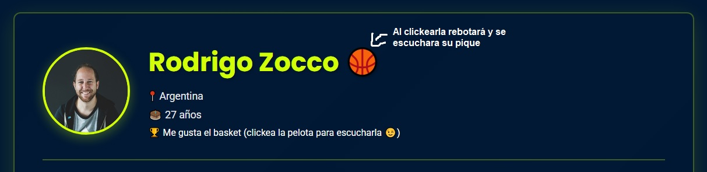

# Grupo 1 – Trabajo Practico uno

🔗 **Deploy:** ToDo: Al deployear, agregar el link

---

## 📌 Descripción del Proyecto

Este trabajo práctico consiste en el desarrollo de un sitio web interactivo que presenta perfiles individuales junto con una portada dinámica. El objetivo principal es aplicar conocimientos de HTML, CSS y JavaScript para construir una interfaz atractiva, funcional y responsive. El proyecto incluye navegación entre páginas, animaciones, y elementos interactivos que mejoran la experiencia del usuario.

---

## 👥 Integrantes

- A – Florencia Guzman - https://github.com/fguzman3026
- B – Martin Morales - https://github.com/juliomorales-cell
- C – Facundo Azcue - https://github.com/fazcue
- D – Rodrigo Zocco - https://github.com/RodrigoZocco

---

## 🛠 Tecnologías Utilizadas

- HTML5
- CSS3
- JavaScript
- Google Fonts
- Vercel (deploy)

---

## 📁 Estructura de Archivos

```
README.md
/src
│── index.html
│── bitacora.html
│
├── css/
│   └── Archivos de estilos
│
├── js/
│   └── Archivos de scripts
│
├── assets/
│   └── Recursos varios (por ejemplo, sonidos)
|
├── img/
│   └── (imágenes y avatares)
│
└── integrantes/
    ├── Contiene una carpeta por cada pagina personal
```

- `index.html`: página principal (portada)
- `css/styles.css`: estilos del sitio
- `js/`: funcionalidades dinámicas
- `img/`: recursos gráficos
- `integrantes/`: páginas individuales de cada integrante

---

## 🎨 Guía de Estilos

### 🎨 Paleta de Colores

- Fondo principal: Blanco `#FFFFFF`
- Fondo secundario: Violeta `#6366f1`
- Texto principal: Intercalando (si el fondo era blanco, texto violeta, sino viceversa)
- Texto secundario: Azul muy oscuro `#1f2937`
- En las paginas individuales, cada integrante usará colores a gusto, haciendo un trabajo personalizado.

### 🔤 Tipografías

- Títulos: _Poppins_
- Cuerpo: _Roboto_

### 🧩 Iconografía

- Uso de avatares generados con IA para preservar la privacidad de los integrantes

---

## ⚙️ JavaScript

### Portada (`index.html`)

- A: Función que muestra distintos mensajes al clickear el boton
- B: Hover sencillo para las cartas que contienen nuestros valores (Propósito, Enfoque, Objetivo final)



### Páginas individuales

- En la pagina de Rodrigo:
  - Al clickear la pelota de basket, hará un efecto de pique y se escuchara el sonido de la misma.
    

---

## 🚀 Enlace al Proyecto Desplegado

ToDo: Al deployear, colocar el link

---

## 🤖 Uso de Inteligencia Artificial

### Herramientas

- Claude - Sonnet 4.5

### Uso en Contenido y Código

- Solo se utilizó para un boceto inicial de la pagina home, bitacora y plantilla de integrante.
- Leímos todo el codigo que fue generado por IA y eliminamos lo que era muy complejo o nos costaba integrar, para mantener una honestidad intelectual.

### Imágenes

- Por el momento no generamos imagenes con AI, solamente tomamos imagenes de internet. (Algunas son iconos, y otras son imagenes que fueron generada con AI pero no por nosotros. por ejemplo, la cara de un hombre sonriendo), esto con el objetivo de no usar caras de personas reales.

---
